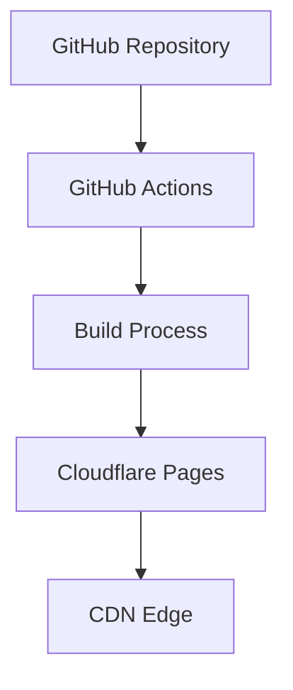

# システムパターン

## プロジェクト構造
### ディレクトリ構造
```
120-web-projects/
├── XXX_project-name/        # 各プロジェクトディレクトリ
│   ├── src/                 # ソースコード
│   ├── tests/              # テストコード
│   ├── package.json        # プロジェクト固有の依存関係
│   └── README.md           # プロジェクト説明
├── apps/                    # Next.jsアプリケーション
│   └── web/                # メインのWebアプリケーション
└── packages/               # 共有パッケージ
    ├── ui/                 # 共有UIコンポーネント
    └── config/            # 共有設定
```

## デプロイメントアーキテクチャ
### 全体構成


### デプロイメントフロー
1. GitHub リポジトリへのプッシュ
2. GitHub Actions による自動ビルド
3. Cloudflare Pages へのデプロイ
4. CDN を通じた配信

## コンポーネント設計
### 基本方針
- **Atomic Design** の採用
  - atoms: 基本的なUI要素
  - molecules: 複数のatomsの組み合わせ
  - organisms: 特定の機能を持つ部品
  - templates: ページのレイアウト
  - pages: 実際のページコンポーネント

### 実装パターン
1. **Presentational Components**
   - UIの表示のみを担当
   - 状態を持たない純粋関数
   - Props経由でデータを受け取る

2. **Container Components**
   - ビジネスロジックを担当
   - 状態管理を行う
   - データの取得・更新を制御

## 状態管理
### ローカル状態
- React Hooks の活用
  - `useState` for simple state
  - `useReducer` for complex state
  - `useContext` for shared state

### 永続化
- LocalStorage の使用
- または State Persistence ライブラリの活用

## エラー処理
### 基本方針
1. **早期リターン**
   ```typescript
   function processData(data: unknown): Result<ProcessedData, Error> {
     if (!isValidData(data)) {
       return err(new ValidationError("Invalid data"));
     }
     // 処理続行
   }
   ```

2. **Result型の使用**
   ```typescript
   type Result<T, E> = {
     ok: true;
     value: T;
   } | {
     ok: false;
     error: E;
   }
   ```

## テスト戦略
### ユニットテスト
- コンポーネントの個別テスト
- ビジネスロジックのテスト
- 型の整合性確認

### 統合テスト
- コンポーネント間の結合テスト
- データフローの検証
- エラー処理の確認

### E2Eテスト
- 重要なユーザーフローのテスト
- デプロイ後の動作確認
- パフォーマンステスト

## セキュリティ対策
### 実装方針
1. **入力検証**
   - バリデーションの徹底
   - サニタイゼーションの実施

2. **XSS対策**
   - エスケープ処理の徹底
   - Content Security Policy の設定

3. **その他**
   - HTTPS強制
   - 適切なCORS設定
   - セキュアなヘッダー設定